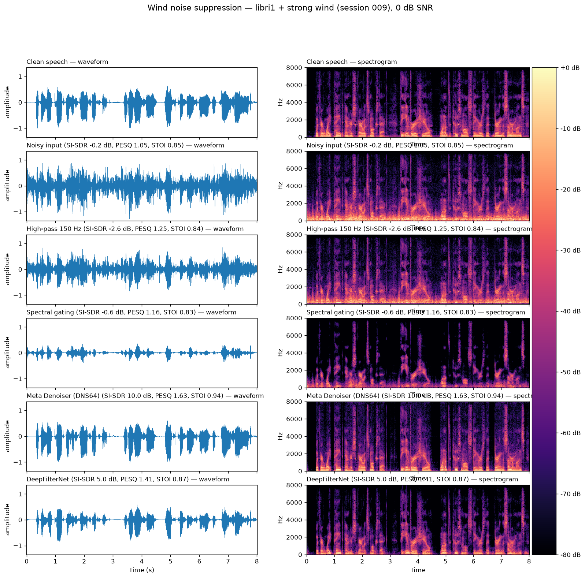

# Wind Noise Suppression Demo

End-to-end demo: mix clean speech with **real recorded wind noise**, then
suppress the wind with classical DSP and neural methods, evaluated with
SI-SDR / PESQ / STOI.

## How it works

1. **Clean speech** — bundled librosa LibriSpeech example (`libri1`), 8 s @ 16 kHz.
2. **Wind noise** — real mobile-phone recordings (strong wind) from the
   [Zenodo Wind Noise Dataset](https://zenodo.org/records/6687982).
   Synthetic wind via
   [SC-Wind-Noise-Generator](https://github.com/audiolabs/SC-Wind-Noise-Generator)
   was used in an earlier iteration (still cloned in `data/`).
3. **Mix** at 0 dB SNR.
4. **Suppress** with four methods (see [Methods](#methods) below).
5. **Evaluate** with SI-SDR, PESQ-WB, and STOI against the clean reference.

## Methods

### 1. High-pass filter (150 Hz Butterworth)

Zero-phase 6th-order Butterworth high-pass (`scipy.signal.butter` +
`sosfiltfilt`). The simplest possible wind suppressor: wind turbulence at a
microphone produces energy that falls off roughly as 1/f, so a fixed cutoff
removes the dominant rumble.

- **Pros:** trivial, zero latency structure, no artifacts above the cutoff.
- **Cons:** fixed trade-off — the cutoff also removes speech fundamentals
  (male F0 ≈ 85–155 Hz). Works only when wind energy is truly confined to low
  frequencies: it was the best method on synthetic wind (energy < 200 Hz) but
  *hurts* SI-SDR on real strong wind, whose gusts extend well above 150 Hz.

### 2. Spectral gating ([noisereduce](https://github.com/timsainb/noisereduce), non-stationary)

STFT-domain noise gate. Estimates a per-frequency noise floor from a smoothed,
time-varying statistic of the signal itself (non-stationary mode, no separate
noise clip needed), then attenuates time-frequency bins that fall below
threshold (`prop_decrease=0.95`).

- **Pros:** no training, no reference signal, adapts to slowly varying noise;
  removes broadband hiss visibly (cleanest-looking spectrogram of the
  classical methods).
- **Cons:** a gate can only *attenuate bins* — where wind and speech overlap
  (0 dB SNR, low frequencies) it either lets wind through or cuts speech.
  Aggressive gating costs speech energy, which is why its STOI drops slightly
  below the noisy input despite looking cleaner.

### 3. [Meta Denoiser](https://github.com/facebookresearch/denoiser) (DNS64)

"Real Time Speech Enhancement in the Waveform Domain" (Défossez et al.,
Interspeech 2020). A causal encoder/decoder U-Net with an LSTM bottleneck that
maps noisy waveform directly to clean waveform (no STFT). We use the
pretrained **DNS64** model (64 hidden channels, ~33 M params, 128 MB), trained
on the Microsoft DNS challenge corpus, which includes wind-like noises.
Native 16 kHz and causal — designed for real-time streaming use.

- **Pros:** best results here by a wide margin (+10 dB SI-SDR on strong wind);
  handles non-stationary gusts because it models *speech*, not the noise.
- **Cons:** 33 M params; can hallucinate/over-smooth speech in conditions far
  from its training data; fixed 16 kHz bandwidth.

### 4. [DeepFilterNet](https://github.com/Rikorose/DeepFilterNet)

Two-stage low-complexity network (Schröter et al., ICASSP 2022/2023): stage 1
enhances a coarse ERB-scaled spectral envelope; stage 2 applies *deep
filtering* — short learned complex FIR filters per time-frequency bin — to
reconstruct periodic speech structure. ~2 M params, designed for embedded /
real-time use, operates natively at 48 kHz full-band.

- **Pros:** ~16× smaller than DNS64, strong PESQ for its size, full-band.
- **Cons:** trails Meta Denoiser here — partly a domain penalty: our 16 kHz
  audio must be resampled to 48 kHz and back, and the model expects full-band
  input. Packaging is dated: its Rust extension has no Python 3.14 wheel and
  it imports an API removed from newer torchaudio, so it runs in a separate
  py3.11 venv (torch 2.1.2) via subprocess (`src/dfn_enhance.py`).

### Method comparison at a glance

| | High-pass | Spectral gate | Meta Denoiser | DeepFilterNet |
|---|---|---|---|---|
| Type | fixed IIR filter | STFT gate | neural (waveform) | neural (spectral) |
| Params / state | none | none | ~33 M | ~2 M |
| Needs training | no | no | pretrained (DNS) | pretrained (DNS4) |
| Causal / real-time | yes (as causal IIR) | yes-ish | yes | yes |
| Native rate | any | any | 16 kHz | 48 kHz |
| Strong wind, 0 dB (SI-SDR) | -2.6 dB | -0.6 dB | **10.0 dB** | 5.0 dB |

See [summary.md](summary.md) for results — TL;DR: on real wind at 0 dB SNR the
neural methods win decisively (Meta Denoiser: +10 dB SI-SDR), while classical
methods that worked on synthetic wind barely help or hurt.

## Setup

```bash
# main env (python 3.14 ok)
python3 -m venv .venv
source .venv/bin/activate
pip install numpy scipy matplotlib soundfile librosa noisereduce spectrum sounddevice \
            torch torchaudio denoiser pesq pystoi

# DeepFilterNet env (needs python <= 3.11 and torch/torchaudio 2.1.2)
python3.11 -m venv .venv-dfn
.venv-dfn/bin/pip install deepfilternet "torch==2.1.2" "torchaudio==2.1.2" soundfile

# data
curl -L -o data/wind_noise_dataset.zip \
  "https://zenodo.org/records/6687982/files/wind_noise_dataset.zip?download=1"
(cd data && unzip wind_noise_dataset.zip)
```

## Run

```bash
source .venv/bin/activate
python src/wind_noise_demo.py          # main demo: metrics + wavs + spectrograms
cd src && python plot_examples.py      # 2-example waveform+spectrogram comparison grids
```

## Listen

Sample audio from Example 1 (libri1 + strong wind, 0 dB SNR) — click a link,
then use the player on the GitHub file page:

| Audio | SI-SDR (dB) | PESQ-WB | STOI |
|---|---:|---:|---:|
| [Clean speech](results/clean.wav) | — | — | — |
| [Wind only](results/wind_only.wav) | — | — | — |
| [Noisy input (speech + wind)](results/noisy.wav) | -0.18 | 1.05 | 0.846 |
| [High-pass 150 Hz](results/enhanced_highpass.wav) | -2.58 | 1.25 | 0.840 |
| [Spectral gating](results/enhanced_spectral_gate.wav) | -0.64 | 1.16 | 0.827 |
| [Meta Denoiser (DNS64)](results/enhanced_meta_denoiser.wav) | 10.00 | 1.63 | 0.943 |
| [DeepFilterNet](results/enhanced_deepfilternet.wav) | 5.02 | 1.41 | 0.873 |

## Outputs

- `results/*.wav` — clean, wind-only, noisy, and enhanced audio (listen to compare)
- `results/metrics.csv` — SI-SDR / PESQ / STOI per method
- `plots/spectrograms.png` — clean / noisy / enhanced spectrograms
- `plots/example1_strong_wind.png`, `plots/example2_normal_wind.png` —
  per-algorithm waveform + spectrogram grids for two speech+wind mixtures
  (libri1 + strong wind, libri2 + normal wind), metrics in each row title



## Datasets

- [Wind Noise Dataset (Zenodo)](https://zenodo.org/records/6687982) — used here:
  478 phone-recorded (normal/strong wind) + 100 generated wind clips, 16 kHz mono
- [Wind Noise Database (RWTH Aachen IKS)](https://www.iks.rwth-aachen.de/forschung/tools-downloads/databases/wind-noise-database)
  — lab + outdoor wind recordings (manual download form)
